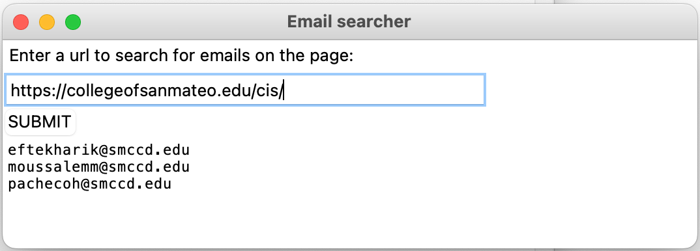

<h2>Your assignment:</h2>
<h3><strong>Part A:</strong></h3>
<ul>
<li>Modify the <strong>handle_data</strong> method from Homework 13 to look for emails on a page. Add the emails to a text variable.
<ul>
<li>You MUST use a regular expression
<ul>
<li>import re&nbsp;</li>
<li>I recommend you use re.search() to check if data looks like an email address</li>
</ul>
</li>
<li>A valid email address has four parts: 
<ul>
<li>A recipient name
<ul>
<li>Uppercase and lowercase letters in English (A-Z, a-z)</li>
<li>Digits from 0 to 9</li>
<li>Special characters: period (.), underscore(_), hyphen (-)</li>
</ul>
</li>
<li>@ symbol</li>
<li>Domain name</li>
<li>Top-level domain</li>
</ul>
</li>
</ul>
</li>
<li>Add a method <strong>collect_emails</strong> to return the emails. You will later call this method when you click the SUMIT button in the GUI that you will develop in Part 2.</li>
<li>Add your personal touch to the window. This can be, for example, background color, image or anything you like.</li>
<li>Test your code.</li>
</ul>

&nbsp;

<h3><strong>Part B:</strong></h3>

After watching the videos in <a title="Week 14 Lesson (GUI)" href="/courses/65722/pages/week-14-lesson-gui?wrap=1" data-api-endpoint="https://smccd.instructure.com/api/v1/courses/65722/pages/week-14-lesson-gui" data-api-returntype="Page">Week 14 Lesson (GUI)</a>, add code to create a GUI for Part 1.

I recommend you follow the instructions in&nbsp;<a class="inline_disabled external" href="https://www.youtube.com/watch?v=_lSNIrR1nZU" target="_blank">Learn Tkinter in 20 minutes</a>.

<h4><strong>Example of a simple window:</strong></h4>

After clicking SUMIT, the user should see the emails displayed in the bottom window.

<strong>You MUST add a personal touch to your window so it looks different from mine and other students in the class! You may change font, color and/or placement of widgets on the window.</strong>

&nbsp;

<h2>Documentation:</h2>
<ul>
<li>Add a header comment at the beginning of your source code containing assignment#, your name and date</li>
<li>Write docstring comments for each function</li>
<li>Add comments explaining sections of your code</li>
</ul>
<h2>Submit:</h2>
<ul>
<li>Your .py file as HW14_firstname_lastname.py</li>
<li>The screenshot of the window you created with Tkinter that shows your program is working as shown above.</li>
</ul>

